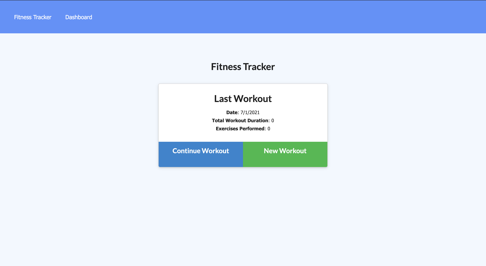
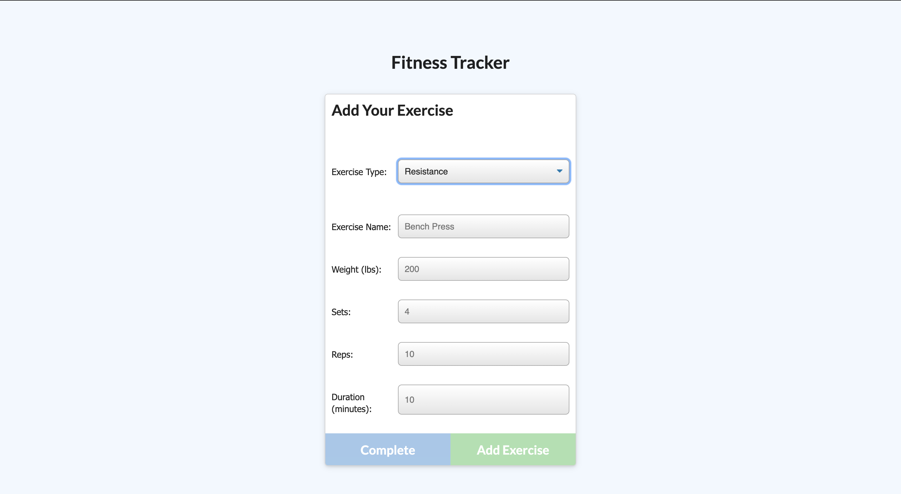
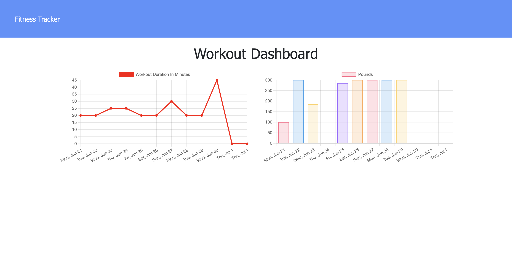

# Workout Tracker
  
## Description

An app where users can add and keep track of their workouts and exercises, including statistics of completed workouts.

## Table of Contents

- [Installation](#installation)
- [Usage](#usage)
- [License](#license)
- [Contributing](#contributing)
- [Tests](#tests)
- [Questions](#questions)

## Installation

To install necessary dependencies, run the following command:

> npm i 

## Tests

To run tests, run the following command:

> npm test 

## Usage

From the homepage, users can either continue a workout or begin a new workout. From the exercise page, users can add information for either cardio or resistance exercises. The dashboard shows the user stats of their completed exercises.

## License

This application is covered under the following license: None

## Contributing

All contributions are welcome!

## Link

https://metric-loon-80521.herokuapp.com/

## Questions

Have questions? Contact this project's creator at ryanascherr@gmail.com.

Their GitHub profile page is https://github.com/ryanascherr.
